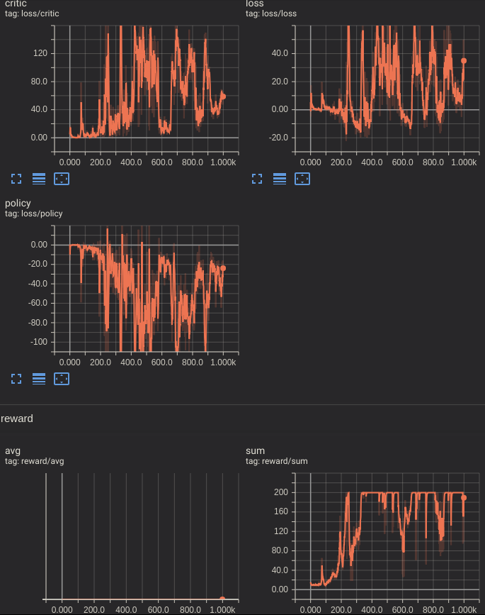

# Simple Pytorch Actor Critic Model

This repository feature a minimalist actor critic model capable of solving 'CartPole-v0' gym environment. The model is wrote in pytorch and use tensorboardX.



## Train & Run

This project require python3.5+ torch, gym and tensorboardX

```bash
python main.py #train the model
python run.py #display an episode
```